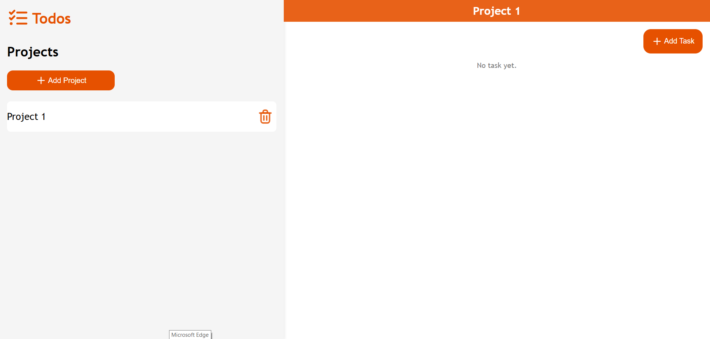

# 📝 My Todos
My Todos is a simple and intuitive to-do list web application that allows users to add, complete, and delete tasks. This project was built to practice and demonstrate front-end development skills using HTML, CSS, and JavaScript.


## 🚀 Getting Started
### Run locally
1. Clone the repository:
```bash
git clone https://github.com/potatopotati/My-Todos.git
```
2. Navigate into the project directory:
```bash
cd My-Todos
```

## 🛠️ Built With
1. HTML
2. CSS
3. Javascript
